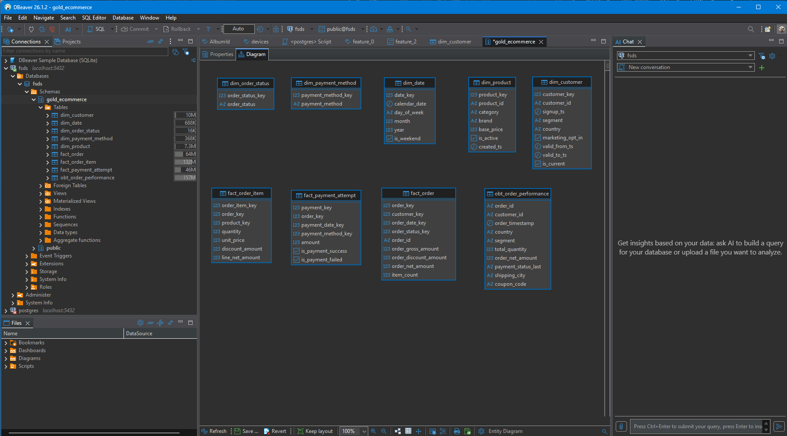
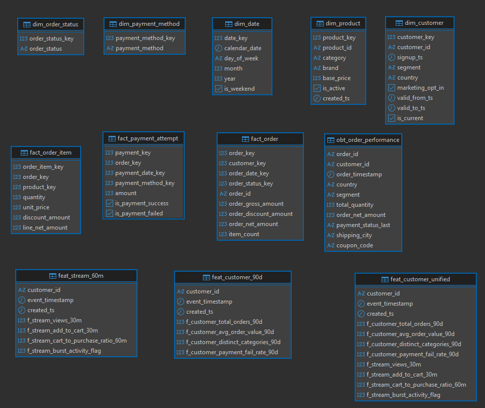

# fsds-ecommerce

Full-stack data science + MLOps system for e-commerce purchase prediction.
Predicts `will_purchase_next_session` for 120,000 customers across a 180-day history window.

---

## Table of Contents

- [Setup](#setup)
- [Local Services & Ports](#local-services--ports)
- [Section 01 — Data Generator](#section-01--data-generator)
- [Section 02 — Schema Pipelines](#section-02--schema-pipelines)
- [Repository Structure](#repository-structure)
- [Git Convention](#git-convention)

---

## Setup

Requires Python 3.13 and [uv](https://github.com/astral-sh/uv).

```bash
git clone <repo-url>
cd fsds-ecommerce
uv sync
source .venv/bin/activate
```

---

## Local Services & Ports

Started via `docker compose -f infra/docker-compose.yml up -d`, plus the Spark UIs that come up while running Section 02 pipelines.

| Service | URL | Port(s) | Login | Notes |
|---|---|---|---|---|
| [MinIO Console](http://localhost:9001) | http://localhost:9001 | 9001 (console), 9000 (S3 API) | `minio_access_key` / `minio_secret_key` | Bronze/Silver Delta Lake object storage |
| [Trino Web UI](http://localhost:8080) | http://localhost:8080 | 8080 | — | Query engine, JDBC on same port |
| Hive Metastore | `thrift://localhost:9083` | 9083 | — | Internal — Trino's catalog connection, no web UI |
| Hive Metastore DB | `localhost:5433` | 5433→5432 | `hive` / `hive` | Postgres backing the metastore, not the Gold DB |
| PostgreSQL (Gold + features) | `localhost:5432` | 5432 | `fsds` / `fsds` | `gold_ecommerce` schema, DB `fsds` |
| [Spark UI](http://localhost:4040) | http://localhost:4040 | 4040 | — | Live DAGs/stages — only while a pipeline job is running |
| [Spark History Server](http://localhost:18080) | http://localhost:18080 | 18080 | — | Completed job UIs — start with `$SPARK_HOME/sbin/start-history-server.sh` |

Commented out in `infra/docker-compose.yml` by default (uncomment + `docker compose up -d <service>` to enable):

| Service | Port | Notes |
|---|---|---|
| Redis | 6379 | Online feature store (Section 04) |
| MLflow | 5000 | Experiment tracking / model registry (Section 04) |
| Airflow webserver | 8081→8080 | DAG orchestration UI (Section 02/04) |

**Browsing Postgres with a GUI** — connect [DBeaver](https://dbeaver.io/) (or any PostgreSQL client):

- Open the DBeaver app (desktop)
- **Database** tab → **New Database Connection**
- Choose **PostgreSQL**
- Enter the connection info:
  - Host: `localhost`
  - Port: `5432`
  - Database: `fsds`
  - User / password: `fsds` / `fsds`
- Click **Test Connection**, then **Finish**
- Right-click the `gold_ecommerce` schema → **View Diagram** for an ER diagram



---

## Section 01 — Data Generator

Generates all synthetic source data consumed by downstream sections.

**Design doc:** [`a_data_generator/docs/01_data_generator.md`](a_data_generator/docs/01_data_generator.md)

### Run

```bash
# Full generation — offline tables + streaming events (~3 min at 120k customers)
uv run python a_data_generator/generator.py

# Offline tables only (faster dev loop)
uv run python a_data_generator/generator.py --skip-stream
```

### Outputs

| Path | Format | Description |
|---|---|---|
| `a_data_generator/outputs/offline/customers.parquet` | Parquet | 120,000 customers |
| `a_data_generator/outputs/offline/products.parquet` | Parquet | 45,000 products |
| `a_data_generator/outputs/offline/orders.parquet` | Parquet | ~360,000 orders |
| `a_data_generator/outputs/offline/order_items.parquet` | Parquet | ~909,000 line items (incl. 2% dups) |
| `a_data_generator/outputs/offline/payments.parquet` | Parquet | ~360,000 payments |
| `a_data_generator/outputs/streaming/events.json` | NDJSON | ~262,000 clickstream events |
| `a_data_generator/outputs/quality_report.txt` | Text | Injected-problem evidence report |

### Injected data problems

| ID | Table | Problem | Target rate | Actual (seed 42) |
|---|---|---|---|---|
| A | orders | 85% shipping_city = Ho Chi Minh City | 85% | 85.1% |
| B | orders | coupon_code + shipping_method NULL before schema_change_date | 100% old-partition | 100% |
| C | order_items | 2% duplicate rows by natural key | 2.0% | 2.0% |
| D | events | 30x burst rate at 12:00-12:20 and 20:00-20:20 | ~3,000 ev/min peak | 3,158 ev/min |
| E | events | 12% late arrivals (created_ts delayed 5-45 min) | 12% | 12.0% |
| F | events | 1.5% duplicate event_ids | 1.5% | 1.5% |

Full evidence table in [`a_data_generator/outputs/quality_report.txt`](a_data_generator/outputs/quality_report.txt).

### Config

All parameters are in [`a_data_generator/config/generator_config.yaml`](a_data_generator/config/generator_config.yaml).
Key fields:

```yaml
n_customers: 120000
random_seed: 42              # reproducible across runs
schema_change_date: "2026-03-24"   # Problem B cutoff
duplicate_rate_offline: 0.02       # Problem C
burst_multiplier: 30               # Problem D
late_arrival_rate: 0.12            # Problem E
duplicate_rate_stream: 0.015       # Problem F
```

---

## Section 02 — Schema Pipelines

Bronze → Silver → Gold → Feature pipelines. Reads Section 01 outputs, lands them as Delta Lake tables (Bronze/Silver, on MinIO), builds the Kimball star schema (Gold, on PostgreSQL), then computes offline/streaming feature tables for Feast.

**Design docs:**
- [`b_schema_pipelines/docs/02_schema_piplines.md`](b_schema_pipelines/docs/02_schema_piplines.md) — schema design
- [`b_schema_pipelines/docs/02_spark_optimisation_report.md`](b_schema_pipelines/docs/02_spark_optimisation_report.md) — Spark optimisation before/after
- [`b_schema_pipelines/pipelines/bronze/README.md`](b_schema_pipelines/pipelines/bronze/README.md) — Bronze + Silver run guide
- [`b_schema_pipelines/pipelines/gold/README.md`](b_schema_pipelines/pipelines/gold/README.md) — Gold run guide

### Run

```bash
cd /mnt/d/fsds-ecommerce
source .venv/bin/activate

# Step 0 — start MinIO/Trino/Postgres (see Local Services & Ports)
docker compose -f infra/docker-compose.yml up -d

# Step 0b — one-time: create the Gold schema in Postgres
docker exec -it fsds-postgres psql -U fsds -d fsds -c "CREATE SCHEMA IF NOT EXISTS gold_ecommerce;"

# Step 0c — start the Spark History Server (captures completed-job UI)
export SPARK_HOME=$(python3 -c "import pyspark, os; print(os.path.dirname(pyspark.__file__))")
mkdir -p /tmp/spark-events
$SPARK_HOME/sbin/start-history-server.sh
# If you see "HistoryServer running as process XXXX. Stop it first." — reset it:
#   $SPARK_HOME/sbin/stop-history-server.sh && $SPARK_HOME/sbin/start-history-server.sh

# Step 1 — Bronze: raw parquet/NDJSON → Delta Lake (MinIO)
uv run python3 b_schema_pipelines/pipelines/bronze/ingest_bronze.py

# Step 2 — Silver: dedup, NULL-fill, skew/broadcast join fixes
uv run python3 b_schema_pipelines/pipelines/silver/transform_silver.py --mode baseline
uv run python3 b_schema_pipelines/pipelines/silver/transform_silver.py --mode optimized

# Step 3 — Gold: dim/fact/OBT star schema → PostgreSQL gold_ecommerce
uv run python3 b_schema_pipelines/pipelines/gold/build_gold.py --mode baseline
uv run python3 b_schema_pipelines/pipelines/gold/build_gold.py --mode optimized

# Step 4 — Features: rolling 90d + 60m aggregations → Feast-ready tables
uv run python b_schema_pipelines/pipelines/features/feat_customer_90d.py

# Step 4b — Flink: cleans/dedupes/watermarks the event stream (own Python 3.12 env —
# see b_schema_pipelines/pipelines/streaming/README.md)
uv run --no-project --python 3.12 --with apache-flink python3 \
b_schema_pipelines/pipelines/streaming/flink_stream_pipeline.py --mode optimized

uv run python b_schema_pipelines/pipelines/features/feat_stream_60m.py \
    --events-source b_schema_pipelines/streaming_data/flink_clean_events/optimized

# Step 5 — Unified: point-in-time (as-of) join of the two feature tables above
uv run python b_schema_pipelines/pipelines/features/feat_customer_unified.py
```

### Outputs

| Layer | Storage | Location |
|---|---|---|
| Bronze | Delta Lake | `s3a://bronze-data/bronze/<table>/` on MinIO |
| Silver | Delta Lake | `s3a://silver-data/silver/<table>/` on MinIO |
| Gold | PostgreSQL | `gold_ecommerce.{dim_*, fact_*, obt_order_performance}` |
| Features | PostgreSQL | `feat_customer_90d`, `feat_stream_60m`, `feat_customer_unified` |
| Flink clean stream | NDJSON | `b_schema_pipelines/streaming_data/flink_clean_events/<mode>/` (local disk) |
| Logs | Text | `logs/{bronze,silver,gold,feat_90d,feat_60m,feat_unified}/<run_id>.log` |

See [Local Services & Ports](#local-services--ports) for MinIO/Postgres/Spark UI access.

**ER diagram** — `gold_ecommerce` dims/facts/OBT plus the `feat_*` feature tables (DBeaver → right-click schema → **View Diagram**):



### Cleanup

```bash
# Delete all objects + the bucket bronze-data itself
docker exec fsds-minio mc rb --force local/bronze-data

# Stop the Spark History Server
$SPARK_HOME/sbin/stop-history-server.sh
rm -rf /tmp/spark-events/*
```

---

## Repository Structure

Reflects what's actually implemented today. `c_drift_labels/` (Section 03) and most of `d_ml/` (Section 04) are scaffolded directories, not yet built out.

```
fsds-ecommerce/
├── a_data_generator/            # Section 01 — synthetic data generator
│   ├── generator.py
│   ├── config/generator_config.yaml
│   ├── docs/01_data_generator.md
│   └── outputs/                 # offline/ + streaming/ (generated, not committed)
├── b_schema_pipelines/          # Section 02 — Bronze/Silver/Gold/Feature pipelines
│   ├── pipelines/
│   │   ├── bronze/               # ingest_bronze.py + README.md
│   │   ├── silver/                # transform_silver.py
│   │   ├── gold/                    # build_gold.py + README.md
│   │   ├── features/              # feat_customer_90d.py, feat_stream_60m.py, feat_customer_unified.py, sum.md
│   │   ├── streaming/               # flink_stream_pipeline.py + README.md (own Python 3.12 env)
│   │   ├── common/                 # delta_writer.py
│   │   └── pipeline_config.yaml    # shared MinIO/Postgres/Delta config
│   ├── dags/                     # Airflow DAGs (scaffolded)
│   ├── dq/                       # Great Expectations suites (scaffolded)
│   └── docs/                     # 02_schema_piplines.md, 02_spark_optimisation_report.md
├── c_drift_labels/               # Section 03 — drift injection + ML labels (scaffolded)
├── d_ml/                         # Section 04 — ML system (scaffolded)
│   ├── api/                      # FastAPI inference + drift-detection service stubs
│   ├── design/ pipelines/ src/ cicd/
├── infra/
│   ├── docker-compose.yml        # local dev stack (MinIO, Trino, Postgres)
│   ├── terraform/                # GKE cluster + VPC + IAM (planned)
│   └── ansible/                  # CI runner config (planned)
├── tests/
│   ├── a_data_generator/         # Section 01 tests
│   └── b_schema_pipelines/       # Section 02 tests (Bronze/Silver/Gold/Features)
├── config/
│   ├── settings.py
│   └── logging.py
├── docs/                         # cross-cutting design notes (e.g. docker_optimize.md)
├── coursework/                   # coursework proposal + implementation plan
└── pyproject.toml
```

---

## Git Convention

```
feature/<name>
       |
       v
    develop
       |
       v
      main
```

Branch off `develop` for all feature work:

```bash
git checkout develop && git pull
git checkout -b feature/<name>
```

### CI check before push

```bash
uv run ruff check . && uv run pytest --cov=d_ml --cov-report=term-missing tests/ -v
```
