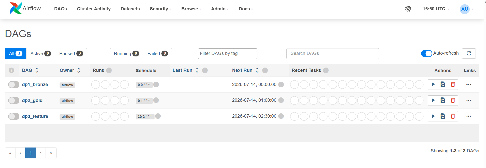

# DP1/DP2/DP3 Orchestration — 12 pts

**Full write-up:** [`b_schema_pipelines/dags/plan.md`](../../b_schema_pipelines/dags/plan.md)

Three Airflow DAGs, one per rubric line item — not a single unified DAG, so each has its own
Airflow UI screenshot with its own stages:

| DAG | Stages | Status |
|---|---|---|
| `dp1_bronze` | `ingest_bronze` → `validate_bronze` | ✅ verified running end-to-end |
| `dp2_gold` | `wait_for_bronze` → `transform_silver` → `validate_silver` → `build_gold` → `validate_gold` | ✅ verified running end-to-end |
| `dp3_feature` | `wait_for_gold` → (`run_flink` → `feat_customer_90d`/`feat_stream_60m` → `feat_customer_unified`) ∥ (`feat_product_90d`/`feat_customer_product_interaction`) → `feat_homepage_unified` → `validate_features` | ✅ verified running end-to-end |

**Confirmed live 2026-07-29:** all three DAGs ran against the real local docker-compose stack
(real MinIO/Postgres/Spark, real generated data) with every `validate_*` task passing for
real — not just via unit tests.

This screenshot does **not** satisfy the rubric's requirement (DAGs list, not Graph view, and
shows 0 completed runs) — the **Graph view** screenshot with a completed run is still
outstanding.

See the linked doc for the full task-by-task design, `ExternalTaskSensor` timing
(`execution_delta`), idempotency, and retry/recovery strategy.
